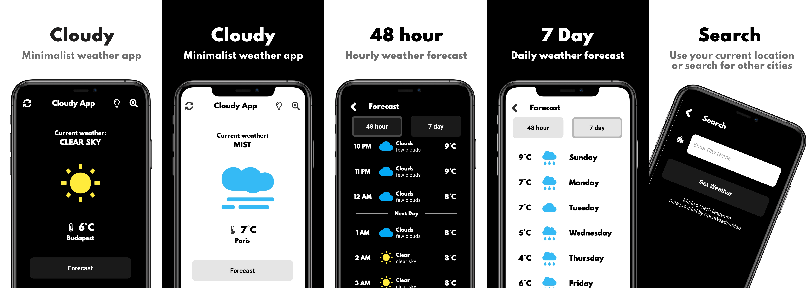

# cloudy_app

Cloudy is a minimalist weather app designed to keep you informed and prepared. With its accurate and up-to-date forecasts, you'll always know what to expect.

## Download:
* **Android:** [Google Play Store](https://play.google.com/store/apps/details?id=com.flutter.hertelendymm.cloudy&hl=en_SG)

## App Screenshots:

## Key Features:
- Intuitive Interface: Enjoy a clean and minimalist design for easy navigation.
- Personalized Forecasts: Get weather updates tailored to your specific location.
- Dark Mode: Choose the theme that best suits your preferences and viewing conditions.
- City Search: Explore weather conditions in cities around the world.
- Multi-Day Forecasts: Plan ahead with current, 48-hour, and 5-day forecasts.

## Data Source:
- Weather data provided by the [OpenWeatherMap](https://openweathermap.org/api)
  - Current Weather: [Current API](https://openweathermap.org/current)
  - 5 day weather forecast: [Forecast5 API](https://openweathermap.org/forecast5)

## Icons:
- Icons: [FontAwesome](https://fontawesome.com/icons)
